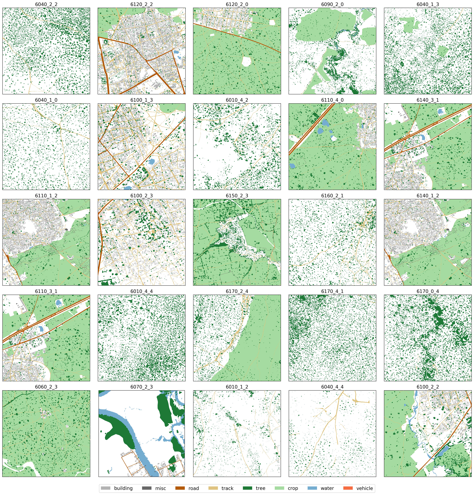
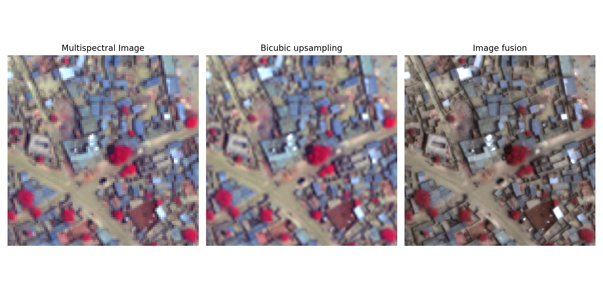
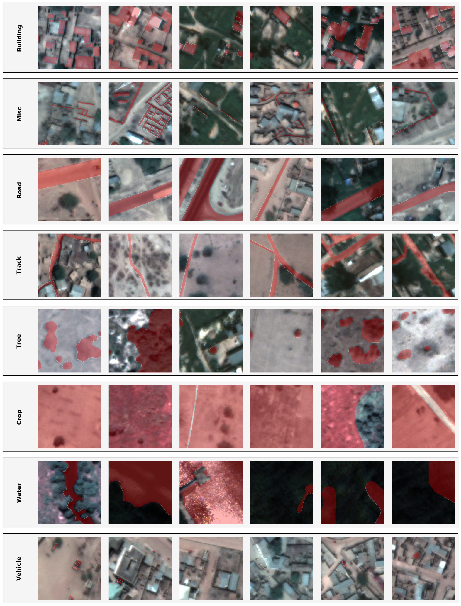

# Deep Semantic Segmentation of Satellite Images 🛰️
---
## Goal
Wouldn't it be nice to automatically get a map from a Satellite image ? Map are easier to read and simplify the representation of the world. Segmentation using deep learning is a popular approach to tackle this problem : _Deep Semantic Segmentation_. The goal is to get a map composed of few categories (buildings, roads, tracks, trees, crops, water, ...) from a multispectral satellite image. Each pixel is thus classified into one of the categories.

## Data
The problem is addressed using the _DSTL dataset_ from this [kaggle competition](https://www.kaggle.com/c/dstl-satellite-imagery-feature-detection/data). It is composed of 25 Worldview 3 satellite images already labelled for 10 categories : building, man-made-structure (misc), road, tracks, trees, crops, standing water, running water, large vehicles and small vehicles. 8 categories are used by combining running and standing water together and large and small vehicles. Below is presented the 25 images masks. Each images are composed of :
* 8 multispectral bands ranging from the visible spectrum to the infrared one with a mild spatial resolution.
* 8 bands of short wave infrared at a low spatial resolution.
* 1 Panchromatic bands at high spatial resolution

The 25 scenes are heterogenous and the classes do not seems evenly distributed among them. Some contains only crops and trees while some are mainly covered by urban areas.

## Data Preparation
The resolution of the SWIR bands is way lower than the multispectral ones and the panchromatic, and may not bring relevant information at the spatial resolution required. That's why only the 8 multispectral bands and the panchromatic ones are used. The input are preprocessed to improve the spatial resolution (pansharpening) and create some common indices of remote sensing that usually helps in discriminating the classes.  

### Indices

Three indices are computed from the multispectral bands.
1. The [NDVI](https://en.wikipedia.org/wiki/Normalized_difference_vegetation_index) that report the vegetation content of a pixel.
2. The [NDWI](https://en.wikipedia.org/wiki/Normalized_difference_water_index) highlight the water bodies.
3. The [EVI](https://en.wikipedia.org/wiki/Enhanced_vegetation_index) also highlight vegetation by taking into account the blue band more sensitive to atmospheric effects, hence correcting for them.

An example of the three indices are presented below for the image 6100_2_2. With the 3 indices, a total of 11 bands are available for each pixel.

### Pansharpening
The spatial resolution of the images are increased by using the information carried in the panchromatic band. first the 11 bands are upsampled to the size of the panchromatic one using a bicubic upsampling. Then each bands is multiplied with 1.5 time the panchromatic image. Finally the each bands histograms is stretched to cover the full range of the color, enhancing the contrast of the image. Below is presented the effect of the pansharpening on a subset of an image.

### Training Sample Generation

From the 25 labelled images, 21 are used for the training (and validation) set, while 4 images are kept aside as the test set (6100_2_2, 6060_2_3, 6110_4_0, 6160_2_1). A sample of for the train/validation set is composed of a 160x160 crop from the images. The dataset is composed of a `pandas.DataFrame` containing the crop coordinates for each image id. The different crops overlap in a way that the center 80x80 regions of the samples cover the whole image since the center region will be more weighted in the loss calculation. The GIF below show how the samples are taken from the image. For each crop which class is present on the center region is also registered in order to be able to extract only crops that contains a building for example.

Below five training samples example for each of the eight classes are presented as the True color image with the mask overlay. We can observe that the mask are sometime inexact or approximate, especially for the crop where trees are counted as crops.   

## Training Procedure

## Results
